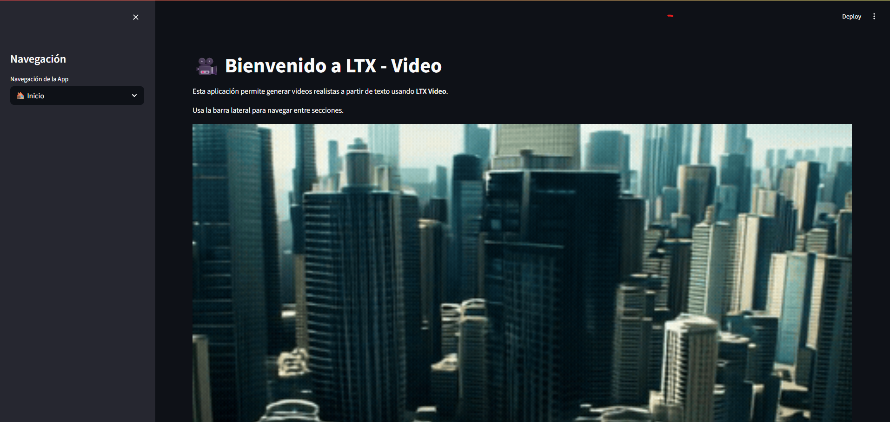
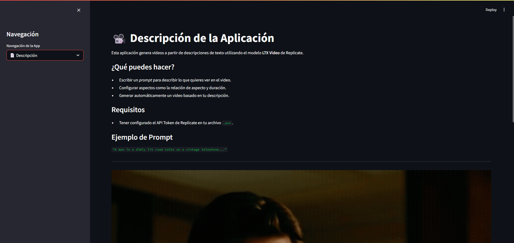
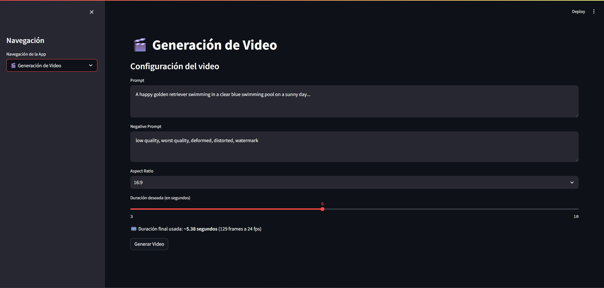

# 🎬 LTX Video Generator

[](https://streamlit.io/)
[](https://www.docker.com/)
[](https://replicate.com/)

Implementacion sencilla en una aplicación web para generar videos de alta calidad usando el modelo **LTX Video** de Lightricks a través de la API de Replicate, con interfaz intuitiva en Streamlit y empaquetado en Docker.

## Características

- Generación de videos de 3-10 segundos con prompts de texto
- Control avanzado mediante negative prompts
- Ajuste de relación de aspecto (16:9, 9:16, etc.)
- Interfaz amigable con previsualización de resultados
- Despliegue local o en la nube con Docker

## Ejemplos Texto a Video 
| | | |
|:---:|:---:|:---:|
| <br><details style="max-width: 300px; margin: auto;"><summary>A woman with long brown hair and light skin smiles at another woman...</summary>A woman with long brown hair and light skin smiles at another woman with long blonde hair. The woman with brown hair wears a black jacket and has a small, barely noticeable mole on her right cheek. The camera angle is a close-up, focused on the woman with brown hair's face. The lighting is warm and natural, likely from the setting sun, casting a soft glow on the scene. The scene appears to be real-life footage.</details> | <br><details style="max-width: 300px; margin: auto;"><summary>A clear, turquoise river flows through a rocky canyon...</summary>A clear, turquoise river flows through a rocky canyon, cascading over a small waterfall and forming a pool of water at the bottom.The river is the main focus of the scene, with its clear water reflecting the surrounding trees and rocks. The canyon walls are steep and rocky, with some vegetation growing on them. The trees are mostly pine trees, with their green needles contrasting with the brown and gray rocks. The overall tone of the scene is one of peace and tranquility.</details> | <br><details style="max-width: 300px; margin: auto;"><summary>Two police officers in dark blue uniforms and matching hats...</summary>Two police officers in dark blue uniforms and matching hats enter a dimly lit room through a doorway on the left side of the frame. The first officer, with short brown hair and a mustache, steps inside first, followed by his partner, who has a shaved head and a goatee. Both officers have serious expressions and maintain a steady pace as they move deeper into the room. The camera remains stationary, capturing them from a slightly low angle as they enter. The room has exposed brick walls and a corrugated metal ceiling, with a barred window visible in the background. The lighting is low-key, casting shadows on the officers' faces and emphasizing the grim atmosphere. The scene appears to be from a film or television show.</details> |
| <br><details style="max-width: 300px; margin: auto;"><summary>A woman with light skin, wearing a blue jacket and a black hat...</summary>A woman with light skin, wearing a blue jacket and a black hat with a veil, looks down and to her right, then back up as she speaks; she has brown hair styled in an updo, light brown eyebrows, and is wearing a white collared shirt under her jacket; the camera remains stationary on her face as she speaks; the background is out of focus, but shows trees and people in period clothing; the scene is captured in real-life footage.</details> | <br><details style="max-width: 300px; margin: auto;"><summary>A man in a dimly lit room talks on a vintage telephone...</summary>A man in a dimly lit room talks on a vintage telephone, hangs up, and looks down with a sad expression. He holds the black rotary phone to his right ear with his right hand, his left hand holding a rocks glass with amber liquid. He wears a brown suit jacket over a white shirt, and a gold ring on his left ring finger. His short hair is neatly combed, and he has light skin with visible wrinkles around his eyes. The camera remains stationary, focused on his face and upper body. The room is dark, lit only by a warm light source off-screen to the left, casting shadows on the wall behind him. The scene appears to be from a movie.</details> | <br><details style="max-width: 300px; margin: auto;"><summary>A prison guard unlocks and opens a cell door...</summary>A prison guard unlocks and opens a cell door to reveal a young man sitting at a table with a woman. The guard, wearing a dark blue uniform with a badge on his left chest, unlocks the cell door with a key held in his right hand and pulls it open; he has short brown hair, light skin, and a neutral expression. The young man, wearing a black and white striped shirt, sits at a table covered with a white tablecloth, facing the woman; he has short brown hair, light skin, and a neutral expression. The woman, wearing a dark blue shirt, sits opposite the young man, her face turned towards him; she has short blonde hair and light skin. The camera remains stationary, capturing the scene from a medium distance, positioned slightly to the right of the guard. The room is dimly lit, with a single light fixture illuminating the table and the two figures. The walls are made of large, grey concrete blocks, and a metal door is visible in the background. The scene is captured in real-life footage.</details> |
| <br><details style="max-width: 300px; margin: auto;"><summary>A man walks towards a window, looks out, and then turns around...</summary>A man walks towards a window, looks out, and then turns around. He has short, dark hair, dark skin, and is wearing a brown coat over a red and gray scarf. He walks from left to right towards a window, his gaze fixed on something outside. The camera follows him from behind at a medium distance. The room is brightly lit, with white walls and a large window covered by a white curtain. As he approaches the window, he turns his head slightly to the left, then back to the right. He then turns his entire body to the right, facing the window. The camera remains stationary as he stands in front of the window. The scene is captured in real-life footage.</details> | <br><details style="max-width: 300px; margin: auto;"><summary>The camera pans across a cityscape of tall buildings...</summary>The camera pans across a cityscape of tall buildings with a circular building in the center. The camera moves from left to right, showing the tops of the buildings and the circular building in the center. The buildings are various shades of gray and white, and the circular building has a green roof. The camera angle is high, looking down at the city. The lighting is bright, with the sun shining from the upper left, casting shadows from the buildings. The scene is computer-generated imagery.</details> | <br><details style="max-width: 300px; margin: auto;"><summary>A man in a suit enters a room and speaks to two women...</summary>A man in a suit enters a room and speaks to two women sitting on a couch. The man, wearing a dark suit with a gold tie, enters the room from the left and walks towards the center of the frame. He has short gray hair, light skin, and a serious expression. He places his right hand on the back of a chair as he approaches the couch. Two women are seated on a light-colored couch in the background. The woman on the left wears a light blue sweater and has short blonde hair. The woman on the right wears a white sweater and has short blonde hair. The camera remains stationary, focusing on the man as he enters the room. The room is brightly lit, with warm tones reflecting off the walls and furniture. The scene appears to be from a film or television show.</details> |


## Cómo Usar

### Requisitos
- Python 3.9+
- Cuenta en [Replicate](https://replicate.com) (API token)
- Docker

## Instalación Local

### Obtención del API Token de Replicate

### Paso 1: Crear cuenta
1. Visita [replicate.com](https://replicate.com)
2. Haz clic en "Sign Up" (registro con GitHub)

### Paso 2: Acceder a API Tokens
1. Haz clic en tu avatar (esquina superior derecha)
2. Selecciona **"API Tokens"** en el menú

### Paso 3: Copiar token
1. Busca tu token en la lista
2. Haz clic en el icono de copiar 📋  
   **⚠️ Importante:** Nunca lo expongas en código público

### Paso 4: Configurar proyecto

1. Clona este repositorio

    ```bash
    git clone https://github.com/tu-usuario/ltx-video-generator.git
    cd ltx-video-generator
    ```

2. Crea archivo `.env` en la raíz del proyecto y pega tu token:
    ```bash
    REPLICATE_API_TOKEN="tu_token_aqui"
    ```

3. Abre una terminal y ejecuta los siguientes comandos

    ```docker
    docker build -t ltx-video .    
    ```

    ```docker
    docker run -p 8501:8501 -e REPLICATE_API_TOKEN=tu_token_aqui ltx-video
    ```

    > [!WARNING]  
    > Asegurate de que Docker este corriendo

---

Si todo salio bien tu proyecto deberia ejecutarse en `https://localhost:8501` y se deberia ver algo asi:


| | | |
|:---:|:---:|:---:|
| <br><summary>Inicio de la aplicación con formulario de generación</summary> | <br><summary>Descripción de la aplicación</summary></details> | <br><summary>Vista de resultado final</summary> |

### Referencias

- Lightricks. (2024). *[LTX-Video: Realtime Video Latent Diffusion](https://arxiv.org/abs/2501.00103)*
- [Replicate LTX-Video](https://replicate.com/lightricks/ltx-video/examples?input=json) – Guía oficial para usar el modelo vía API.  
- [Streamlit Documentation](https://docs.streamlit.io) – Manual oficial para construir interfaces web interactivas.  
- [Docker Documentation](https://docs.docker.com) – Guía de instalación y despliegue de contenedores.  
